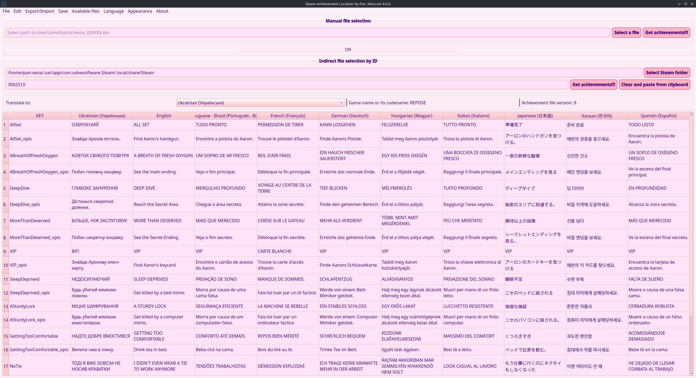

[](https://github.com/PanVena/SteamAchievementLocalizer/blob/main/readmes/README.uk.md)
[](https://github.com/PanVena/SteamAchievementLocalizer/blob/main/readmes/README.pl.md)


<h1 align="center">🏆 Steam Achievement Localizer by Vena</h1>
<p align="center">
A graphical tool (PyQt6) for viewing, editing, and localizing Steam achievement files <code>UserGameStatsSchema_*.bin</code>.
</p>
<p align="center">
<b>⬇️ Download latest release</b>
</p>

<p align="center">
  <a href="https://github.com/PanVena/SteamAchievementLocalizer/releases/latest/download/SteamAchievementLocalizer-win64.zip"></a>
  <a href="https://github.com/PanVena/SteamAchievementLocalizer/releases/latest/download/SteamAchievementLocalizer-linux64.AppImage"></a>
  <a href="https://github.com/PanVena/SteamAchievementLocalizer/releases/"></a>
</p>

<p align="center">
  
</p>

---

## Table of Contents
- [✨ Features](#-features)
- [⚠️ Editing Warning](#️-editing-warning)
- [🚀 Quick Start](#-quick-start)
- [📂 File Locations](#-file-locations)
- [📝 Export / Import](#-export--import)
- [🧠 Processing Algorithm](#-processing-algorithm)
- [🛠 Architecture & Technical Details](#-architecture--technical-details)
- [❓ FAQ](#-faq)
- [🎨 Theme Development](#-theme-development)
- [🌍 Localization](#-localization)
- [🤝 Contributing](#-contributing)
- [🔐 License](#-license)
- [👤 Author & Community](#-author--community)
- [💬 Contact](#-contact)

---

## ✨ Features
- **🚀 Auto-detection of Steam path** (Windows Registry / Linux / Snap variants; macOS partially covered for now).
- **📂 Two loading modes:**
  - manual (select a `.bin`);
  - by Game ID (you can paste a full URL like `https://store.steampowered.com/app/123456/`).
- **🏆 Achievement parsing and table build:**
  - automatic creation of a separate row for descriptions (`*_opis`) if the block has duplicates;
  - automatic addition of a `ukrainian` column if missing;
  - guaranteed presence of `english` (empty if absent in the file).
- **✏️ Table editing** directly inside the app.
- **🔍 Global search** with highlighting + row filtering.
- **🔄 Find / Replace** for a selected column (dialog-based).
- **👁️ Toggle column visibility**.
- **📤 CSV export:**
  - full (all languages in the file);
  - translation format (english + translation + context).
- **📥 CSV import** back into a chosen language column.
- **💾 Overwrite localizations** inside the binary file.
- **📁 View and open** the original binary in the file manager.
- **📋 List of all `UserGameStatsSchema_*.bin`** in Steam with:
  - game name (`gamename`);
  - version (`version`);
  - approximate achievement count (heuristic via number of English entries).
- **⚙️ Settings caching** via `QSettings`: UI language, paths, last ID, last version (for update warning).
- **🌍 Extensible multilingual UI** - currently English / Українська / Polski.
- **🎨 Dynamic theming system** - themes auto-load from JSON files.
- **🔌 Plugin architecture** with modular components.

---

## ⚠️ Editing Warning
Editing `.bin` may cause:
- cache conflicts in Steam;
- incorrect texts being shown;
- the need to regenerate the file.

If the game does not show your translation:
1. Close Steam.
2. Delete the target `UserGameStatsSchema_XXXX.bin`.
3. Open the game’s store / community page (file regenerates).
4. Re-apply your translation.

Recommendation: always make a backup copy of the original `.bin` before changes.

---

## 🚀 Quick Start
1. Download the [latest release](https://github.com/PanVena/SteamAchievementLocalizer/releases/latest).
2. Run the executable.
3. Enter a Game ID or choose a `.bin` manually.
4. Translate / edit.
5. (Optional) Export CSV → send to translators → import back.
6. Save:  
   - directly into Steam (to see changes immediately);  
   - or to a custom path (backup / distribution).

---

## 📂 File Locations
Typical path (Windows):
```
C:\Program Files (x86)\Steam\appcache\stats\UserGameStatsSchema_XXXX.bin
```
Linux (one variant):
```
~/.local/share/Steam/appcache/stats/UserGameStatsSchema_XXXX.bin
```
Snap variants are auto-searched.  
macOS currently does not have guaranteed automatic detection (select manually if needed).

---

## 📝 Export / Import

### Full Export
The CSV contains all columns (including possible internal/service ones). Good for analysis or archival.

### Translation Export
Structure:
```
key,english,translation,<context>
```
- `translation` — the column a translator edits.
- `<context>` — an additional (chosen via dialog) column such as `polish`, `german`, or a descriptive one.

### Import
1. Choose the target column (where data will be written) in the dialog.
2. Load a CSV with fields `key`, `translation`.
3. Empty `translation` cells are ignored (preserve existing values).

### NOTE: Replacing the english column intentionally
If you want to overwrite the built-in `english` strings with (for example) a finalized localized or edited variant:
- Export in translation format (source english kept).
- Edit the `translation` column with the new text that should become the new “english”.
- During import, select `english` as the target column.
- The tool will clear old English entries for each block and inject the new ones.
This lets you repurpose the english column as a normalized / cleaned / community-approved base text. Be aware that other localizations may rely on the semantic meaning of the original English; consider archiving the original first (full export CSV).

---

## 🧠 Processing Algorithm
1. Read raw file bytes.
2. Split into blocks by markers `\x00bits\x00 | \x02bit\x00`.
3. Find achievement key: inside a block pattern `\x00\x01name\x00(.*?)\x00`.
4. Drop block if `\x01english\x00` is absent (ensures basic localizability).
5. Extract language tags via pattern `\x01<lang>\x00<text>\x00`.
6. Filter service words (`EXCLUDE_WORDS` set).
7. Form two potential rows:
   - main (`key`);
   - description (`key_opis`) if duplicate language keys appear.
8. Ensure columns `ukrainian` and `english` exist (insert empty if absent).
9. Build table and order headers: `key`, `ukrainian`, `english`, others (alphabetical).
10. On save:
    - clear previous language segments (for the specific language being rewritten);
    - insert new ones after the `english` marker or replace them if editing English itself;
    - output a rebuilt binary block.

---

## 🛠 Architecture & Technical Details
| Component | Description |
|-----------|-------------|
| GUI | PyQt6 (`QMainWindow`, `QTableWidget`) |
| State persistence | `QSettings` (language, paths, version, last ID) |
| **Localization** | **Auto-loading JSON from `assets/locales/` with metadata support** |
| **Theming** | **Auto-loading JSON from `assets/themes/` with priority-based sorting** |
| **Plugin system** | **Modular components: `theme_manager`, `ui_builder`, `file_manager`, etc.** |
| Search highlighting | Custom `HighlightDelegate` |
| Dialogs | `FindReplaceDialog`, `ContextLangDialog`, `UserGameStatsListDialog` |
| UI framework | Custom JSON localization system (not Qt Linguist) |
| Insertion algorithm | Positional scanning + byte-wise `bytearray` assembly |
| Row formation | Heuristic to avoid duplicates (description goes into `_opis`) |

---

## ❓ FAQ

| Question | Answer |
|----------|--------|
| I don’t see the translation in Steam | Close Steam → delete the file → open the game page |
| List is empty | Wrong file or missing `english` markers |
| Garbled characters | Ensure UTF-8 and proper CSV formatting |
| No undo after import | Import rebuilds the table completely — expected |
| How many languages are supported? | As many as exist in the `.bin` + enforced `ukrainian` |
| Can I add another UI language? | Yes: add JSON in `assets/locales/` |

---

## 🤝 Contributing
1. Fork → create a branch → make changes → Pull Request.
2. Clearly state what the PR changes (UI / logic / localization).
3. **For themes** — simply add JSON files to `assets/themes/` (see [theme guide](readmes/contribution/THEMES.md)).
4. **For languages** — simply add JSON files to `assets/locales/` (see [localization guide](readmes/contribution/LOCALES.md)).
5. Verify:
   - file loading;
   - export / import;
   - saving into Steam and to a separate file;
   - no crashes when switching UI language.

To propose an idea without code — open an Issue.

---

## 🎨 Theme Development

Want to create custom themes for the application? **No code editing required!** 

Simply create a JSON file in `assets/themes/` and your theme will automatically appear in the menu.

**📖 Documentation:**
- **[Theme Creation Guide (English)](readmes/contribution/THEMES.md)** - Complete instructions for creating custom themes
- **[Посібник зі створення тем (Українська)](readmes/contribution/THEMES_UA.md)** - Повна інструкція українською мовою

**✨ Features:**
- 🎨 **Auto-discovery**: Drop a JSON theme file → appears in menu automatically
- 🌍 **Multi-language support**: Theme names in multiple languages
- 📊 **Smart ordering**: Control theme position with priority values  
- 🎯 **No coding**: Pure JSON configuration, no source code changes needed

**Example theme structure:**
```json
{
  "name": "MyTheme",
  "display_names": {
    "en": "🌙 Dark Blue",
    "ua": "🌙 Темно-синя"
  },
  "priority": 50,
  "palette": { /* colors */ },
  "styles": { /* CSS */ }
}
```

---

## 🌍 Localization  

Want to add your language to the application? **No code editing required!**

Simply create a JSON file in `assets/locales/` and your language will automatically appear in the menu.

**📖 Documentation:**
- **[Language Addition Guide (English)](readmes/contribution/LOCALES.md)** - Complete instructions for adding new languages
- **[Посібник з додавання мов (Українська)](readmes/contribution/LOCALES_UA.md)** - Повна інструкція українською мовою

**✨ Features:**
- 🌐 **Auto-discovery**: Drop a JSON locale file → appears in Language menu automatically
- 📊 **Smart ordering**: Control language position with priority values
- 🔄 **Fallback system**: Missing translations fall back to English
- 🎯 **No coding**: Pure JSON configuration, no source code changes needed

**Example locale structure:**
```json
{
  "_locale_info": {
    "name": "Español",
    "native_name": "Español (Spanish)", 
    "code": "es",
    "priority": 40
  },
  "app_title": "Localizador de Logros...",
  "language": "Idioma"
  // ... other translations
}
```

**Current languages:**
- 🇬🇧 **English** (priority: 10)  
- 🇺🇦 **Українська** (priority: 20)
- 🇵🇱 **Polski** (priority: 30)

---

## 🔐 License
MIT — freely use, modify, translate. A ⭐ and author attribution are appreciated.

---

## 👤 Author & Community
Author: **Vena**  
- [GitHub](https://github.com/PanVena)  
- Telegram: [@Pan_Vena](https://t.me/Pan_Vena)

Translator / discussion community:
- Channel: [Ліниві ШІ](https://t.me/linyvi_sh_ji)

---

## 💬 Contact
Ideas / questions / bugs → Issue or Telegram.  
Like the project? — Share with localization communities & drop a ⭐.

<p align="center">Made with love for localization & games 💛💙</p>