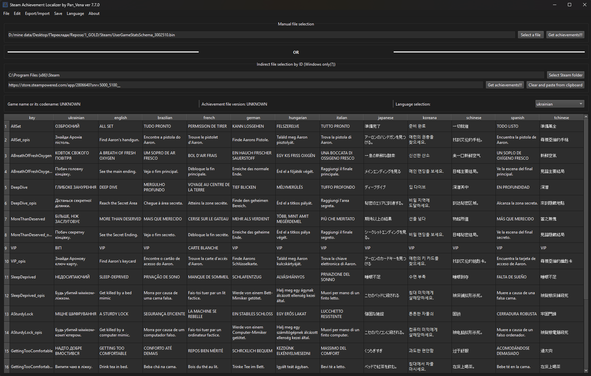

<h1>🏆 Steam Achievement Localizer by Vena</h1>

<strong>Steam Achievement Localizer</strong> is a PyQt6-based GUI tool for editing Steam achievement files (UserGameStatsSchema_xxx.bin).
It allows you to translate and localize achievement descriptions and save changes either directly into your Steam folder or as a separate file. 

<a class="button-link" href="https://github.com/PanVena/SteamAchievementLocalizer/releases/latest" target="_blank">👉 Download the latest version 👈</a>

## 📌 Features
- Automatic detection of the Steam folder (via Windows Registry).  
- Load `UserGameStatsSchema_*.bin` file:
  - manually,
  - or automatically via a game ID.  
- View and edit achievement tables.  
- Column-based search.  
- Export to CSV:
  - all languages at once,
  - special format for translation.  
- Import translations from CSV back into the app.  
- Automatic support for Ukrainian (adds the column if missing).  
- Replace translations directly inside `.bin` files.  
- Save:
  - directly into Steam’s folder,
  - or to any custom location.  
- Multi-language UI (English, Ukrainian, Polish).  

<blockquote>
   <h4> 
<strong><i>In guides for localizers, we say to put the file in "C:\Program Files (x86)\Steam\appcache\stats\", replacing the original.</i></strong>
</h4>
</blockquote>

<strong>🧯 If you encounter errors — delete the file here, restart Steam, and visit the game page in your library:</strong> 
<code>C:\Program Files (x86)\Steam\appcache\stats\UserGameStatsSchema_XXXX.bin</code> 
<strong>Or find it in its natural habitat)</strong>

<h2>👥 Community</h2>

Join the translators' community: 
<a href="https://t.me/linyvi_sh_ji" target="_blank">👉 Telegram channel "Lazy AI`s"</a>

<h2>🛠 Technical Details</h2>
<ul>
    <li>Works with <code>UserGameStatsSchema_XXXX.bin</code> Steam files</li>
    <li>Text is extracted using the pattern <code>\x01{language}\x00{text}\x00</code></li>
    <li><code>ukrainian</code> is automatically added if missing</li>
    <li>Only necessary languages are edited, all other bytes remain untouched</li>
</ul>

<h2>🔖 License</h2>

MIT — use, modify, translate, save, enjoy.

<h2>🧑‍💻 Author</h2>

<strong>Vena</strong> 
<a href="https://github.com/PanVena" target="_blank">GitHub</a> | <a href="https://t.me/Pan_Vena" target="_blank">Telegram</a>

