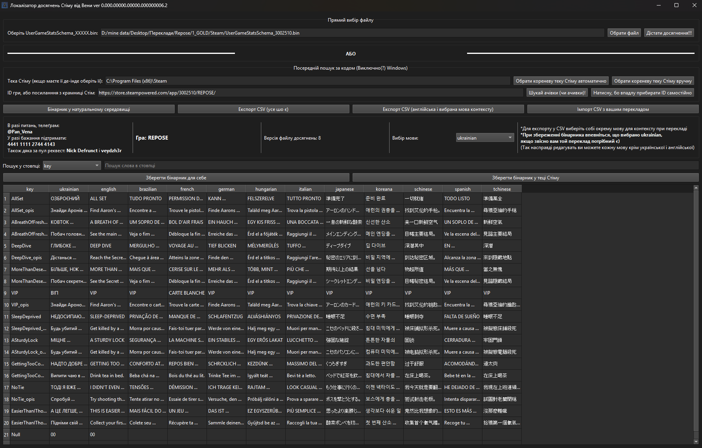

<h1>🏆 Steam Achievement Localizer by Vena</h1>

<strong>Steam Achievement Localizer</strong> is a 💻 desktop application built with <strong>Python + PyQt6</strong> that makes it easy to <strong>view</strong>, <strong>export</strong>, <strong>translate</strong>, and <strong>edit achievements</strong> in Steam <code>.bin</code> files. 

<a class="button-link" href="https://github.com/PanVena/SteamAchievementLocalizer/releases/latest" target="_blank">👉 Download the latest version 👈</a>

<h2>💡 Key Features</h2>
<ul>
    <li>📂 Reads Steam <code>.bin</code> files (<code>UserGameStatsSchema_XXXX.bin</code>)</li>
    <li>📊 Convenient achievement table view</li>
    <li>🧾 Export to <strong>CSV</strong> with <strong>context support</strong></li>
    <li>🌐 Import your own translations from CSV back into <code>.bin</code></li>
    <li>🌍 Supports <strong>many languages</strong>, including <code>ukrainian</code></li>
    <li>🧠 Search result highlighting</li>
    <li>🔎 Automatic Steam path detection</li>
    <li>🔐 Safe editing — only necessary fields, everything else is preserved</li>
</ul>

<h2>📋 How to Use</h2>
<ol>
    <li>Run the program</li>
    <li>Automatically select the Steam folder (or leave the default: <code>C:\Program Files (x86)\Steam</code>)</li>
    <li>Enter the game ID or a link from the Steam store</li>
    <li>Click "Find achievements"!</li>
    <li>View the achievement table</li>
    <li>Select a language from the list</li>
    <li>Click "Export CSV"</li>
    <li>Fill in the <code>ukrainian</code> column in the CSV file with your translation</li>
    <li>Import the file back</li>
    <li>Click "Save binary" to replace the Steam file or save a copy for yourself</li>
</ol>

<blockquote>
   <h2> 
<strong><i>In guides for localizers, we say to put the file in "C:\Program Files (x86)\Steam\appcache\stats\", replacing the original.</i></strong>
</h2>
</blockquote>

<strong>🧯 If you encounter errors — delete the file here, restart Steam, and visit the game page in your library:</strong> 
<code>C:\Program Files (x86)\Steam\appcache\stats\UserGameStatsSchema_XXXX.bin</code> 
<strong>Or find it in its natural habitat)</strong>

<h2>✏️ CSV File Structure</h2>

<table>
    <thead>
        <tr>
            <th>key</th>
            <th>english</th>
            <th>ukrainian</th>
            <th>context_column (any)</th>
        </tr>
    </thead>
    <tbody>
        <tr>
            <td>NAME_ACHIEVE</td>
            <td>First Step</td>
            <td>Перший крок</td>
            <td>Pierwszy krok</td>
        </tr>
    </tbody>
</table>

<h2>📦 Installation (for developers)</h2>
<pre><code>git clone https://github.com/PanVena/SteamAchievementLocalizer.git
cd SteamAchievementLocalizer
pip install -r requirements.txt
python SteamAchievementLocalizer.py
</code></pre>

<strong>Required:</strong> Python 3.10+, PyQt6, csv, re

<h2>👥 Community</h2>

Join the translators' community: 
<a href="https://t.me/linyvi_sh_ji" target="_blank">👉 Telegram channel "Lazy AI`s"</a>

<h2>🛠 Technical Details</h2>
<ul>
    <li>Works with <code>UserGameStatsSchema_XXXX.bin</code> Steam files</li>
    <li>Text is extracted using the pattern <code>\x01{language}\x00{text}\x00</code></li>
    <li><code>ukrainian</code> is automatically added if missing</li>
    <li>Only necessary languages are edited, all other bytes remain untouched</li>
</ul>

<h2>🔖 License</h2>

MIT — use, modify, translate, save, enjoy.

<h2>🧑‍💻 Author</h2>

<strong>Vena</strong> 
<a href="https://github.com/PanVena" target="_blank">GitHub</a> | <a href="https://t.me/Pan_Vena" target="_blank">Telegram</a>

<h1>🏆 Steam Achievement Localizer від Вени</h1>
