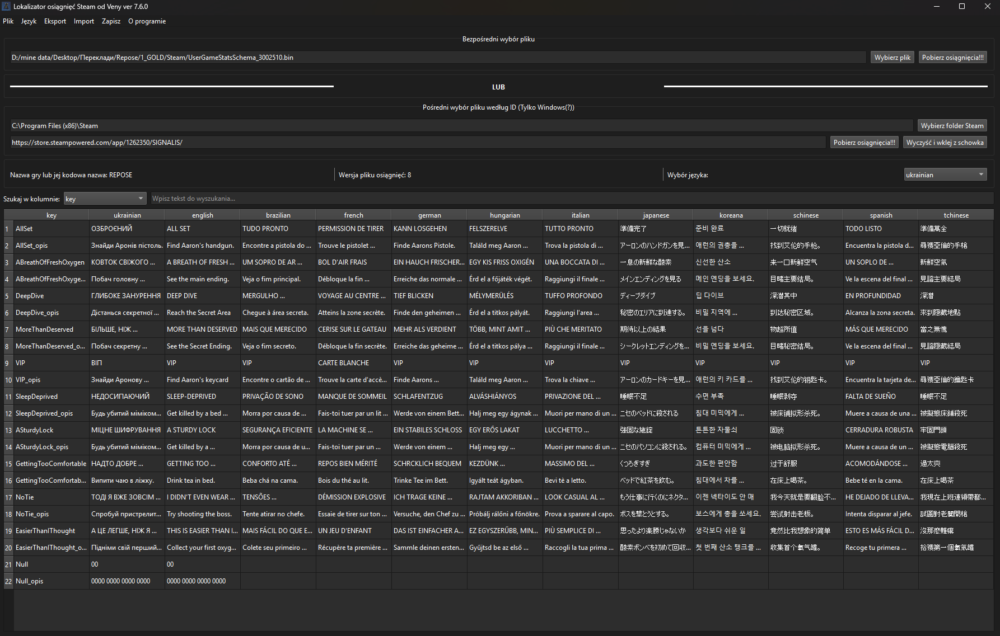

<h1>🏆 Lokalizator osiągnięć Steam od Veny</h1>

<strong>Steam Achievement Localizer</strong> to narzędzie GUI oparte na PyQt6 do edycji plików osiągnięć Steam (UserGameStatsSchema_xxx.bin).
Pozwala tłumaczyć i lokalizować opisy osiągnięć oraz zapisywać zmiany bezpośrednio w folderze Steam lub jako osobny plik.

<a class="button-link" href="https://github.com/PanVena/SteamAchievementLocalizer/releases/latest" target="_blank">👉 Pobierz najnowszą wersję 👈</a>

## 📌 Funkcje
- Automatyczne wykrywanie folderu Steam (przez Rejestr Windows).
- Ładowanie pliku `UserGameStatsSchema_*.bin`:
  - ręcznie,
  - lub automatycznie według ID gry.
- Podgląd i edycja tabeli osiągnięć.
- Wyszukiwanie według kolumny.
- Eksport do CSV:
  - wszystkie języki naraz,
  - specjalny format do tłumaczenia.
- Import tłumaczeń z CSV z powrotem do aplikacji.
- Automatyczne wsparcie dla języka ukraińskiego (dodaje kolumnę, jeśli jej brakuje).
- Podmiana tłumaczeń bezpośrednio w plikach `.bin`.
- Zapis:
  - bezpośrednio do folderu Steam,
  - lub w dowolne miejsce.
- Wielojęzyczny interfejs (angielski, ukraiński).

<blockquote>
   <h4> 
<strong><i>W przewodnikach dla tłumaczy zalecamy umieszczenie pliku w „C:\Program Files (x86)\Steam\appcache\stats\”, zastępując oryginał.</i></strong>
</h4>
</blockquote>

<strong>🧯 Jeśli napotkasz błędy — usuń plik tutaj, zrestartuj Steam i wejdź na stronę gry w swojej bibliotece:</strong> 
<code>C:\Program Files (x86)\Steam\appcache\stats\UserGameStatsSchema_XXXX.bin</code> 
<strong>Lub znajdź go w jego naturalnym środowisku :)</strong>

<h2>👥 Społeczność</h2>

Dołącz do społeczności tłumaczy: 
<a href="https://t.me/linyvi_sh_ji" target="_blank">👉 Kanał Telegram „Leniwi SI”</a>

<h2>🛠 Szczegóły techniczne</h2>
<ul>
    <li>Działa z plikami <code>UserGameStatsSchema_XXXX.bin</code> Steam</li>
    <li>Tekst wyciągany jest według wzoru <code>\x01{language}\x00{text}\x00</code></li>
    <li><code>ukrainian</code> dodawany automatycznie, jeśli brak</li>
    <li>Edytowane są tylko wybrane języki, pozostałe bajty pozostają nienaruszone</li>
</ul>

<h2>🔖 Licencja</h2>

MIT — używaj, modyfikuj, tłumacz, zapisuj i ciesz się.

<h2>🧑‍💻 Autor</h2>

<strong>Vena</strong> 
<a href="https://github.com/PanVena" target="_blank">GitHub</a> | <a href="https://t.me/Pan_Vena" target="_blank">Telegram</a>

