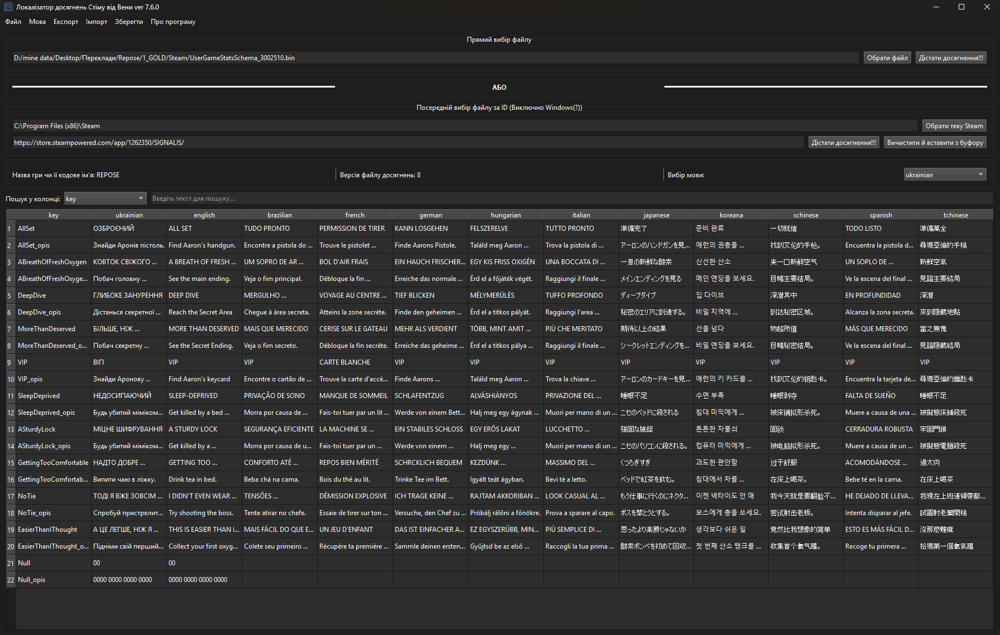

<h1>🏆 Steam Achievement Localizer від Вени</h1>

<strong>Steam Achievement Localizer</strong> — є інструментом із графічним інтерфейсом на базі **PyQt6** для редагування файлів досягнень Steam (`UserGameStatsSchema_xxx.bin`).  
Він дозволяє перекладати та локалізувати описи досягнень, а також зберігати зміни безпосередньо у теку Steam або у окремий файл.  

<a class="button-link" href="https://github.com/PanVena/SteamAchievementLocalizer/releases/latest" target="_blank">👉 Завантажити останню версію 👈</a>

## 📌 Можливості
- Автоматичне визначення теки Steam (через реєстр Windows).  
- Завантаження файлу `UserGameStatsSchema_*.bin`:
  - вручну,  
  - або автоматично за ID гри.  
- Перегляд і редагування таблиць досягнень.  
- Пошук по стовпцях.  
- Експорт у CSV:
  - всі мови одразу,  
  - спеціальний формат для перекладу.  
- Імпорт перекладів із CSV назад у програму.  
- Автоматичне додавання української (якщо відсутня у файлі).  
- Заміна перекладів безпосередньо у `.bin` файлах.  
- Збереження:
  - напряму у теку Steam,  
  - або у довільне місце.  
- Багатомовний інтерфейс (англійська, українська).  

<blockquote>
   <h2> 
<strong><i>У посібничках до українізаторів кажемо, що файлик кидать до "C:\Program Files (x86)\Steam\appcache\stats\", з заміною.</i></strong>
</h2>
</blockquote>

<strong>🧯 У разі помилок — видали файл отут і перезапусти стім і зайшовши на сторінку гри у бібліотеці:</strong> 
<code>C:\Program Files (x86)\Steam\appcache\stats\UserGameStatsSchema_XXXX.bin</code> 
<strong>Або знайшовши його у природному середовищі)</strong>

<h2>✏️ Структура CSV-файлу</h2>

<table>
    <thead>
        <tr>
            <th>key</th>
            <th>english</th>
            <th>ukrainian</th>
            <th>context_column (будь-яка)</th>
        </tr>
    </thead>
    <tbody>
        <tr>
            <td>NAME_ACHIEVE</td>
            <td>First Step</td>
            <td>Перший крок</td>
            <td>Pierwszy krok</td>
        </tr>
    </tbody>
</table>

<h2>📦 Встановлення (для розробників)</h2>
<pre><code>git clone https://github.com/PanVena/SteamAchievementLocalizer.git
cd SteamAchievementLocalizer
pip install -r requirements.txt
python SteamAchievementLocalizer.py
</code></pre>

<strong>Потрібно:</strong> Python 3.10+, PyQt6, csv, re

<h2>👥 Спільнота</h2>

Приєднуйтесь до спілки перекладачів: 
<a href="https://t.me/linyvi_sh_ji" target="_blank">👉 Телеграм-канал "Ліниві ШІ"</a>

<h2>💰 Подякувати</h2>

Якщо софт зекономив тобі час і нерви — можеш «перекинути кілька біткоїнів гривнею» 😄 
<a href="https://send.monobank.ua/jar/9V3wRMZD7C" target="_blank">➡ ТУТ 🌻 Mono Jar</a>

<h2>🛠 Технічні деталі</h2>
<ul>
    <li>Працює з <code>UserGameStatsSchema_XXXX.bin</code> файлами Steam</li>
    <li>Текст витягується через патерни <code>\x01{language}\x00{text}\x00</code></li>
    <li>Автоматично додається <code>ukrainian</code>, якщо його нема</li>
    <li>Редагуються лише необхідні мови, решта байтів залишаються недоторканими</li>
</ul>

<h2>🔖 Ліцензія</h2>

MIT — користуйся, змінюй, перекладай, зберігай, радій.

<h2>🧑‍💻 Автор</h2>

<strong>Вена</strong> 
<a href="https://github.com/PanVena" target="_blank">GitHub</a> | <a href="https://t.me/Pan_Vena" target="_blank">Telegram</a>

