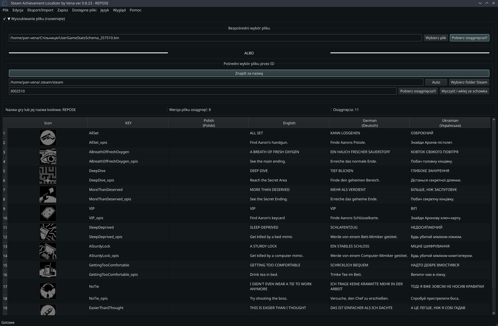

[](https://github.com/PanVena/SteamAchievementLocalizer/blob/main/readmes/README.uk.md)
[](https://github.com/PanVena/SteamAchievementLocalizer/blob/main/README.md)


<h1 align="center">🏆 Lokalizator osiągnięć Steam od Veny</h1>
<p align="center">
Graficzne narzędzie (PyQt6) do przeglądania, edycji i lokalizacji plików osiągnięć Steam <code>UserGameStatsSchema_*.bin</code>.
</p>
<p align="center">
  <a href="https://github.com/PanVena/SteamAchievementLocalizer/releases/latest"><b>⬇️ Pobierz najnowszą wersję</b></a>
</p>

<p align="center">
  
</p>

---

## Spis treści
- [✨ Funkcje](#-funkcje)
- [⚠️ Ostrzeżenie o edycji](#️-ostrzeżenie-o-edycji)
- [🚀 Szybki start](#-szybki-start)
- [📂 Lokalizacja plików](#-lokalizacja-plików)
- [📝 Eksport / Import](#-eksport--import)
- [🧠 Algorytm przetwarzania](#-algorytm-przetwarzania)
- [🛠 Architektura i szczegóły techniczne](#-architektura-i-szczegóły-techniczne)
- [❓ FAQ](#-faq)
- [🎨 Tworzenie motywów](#-tworzenie-motywów)
- [🤝 Kontrybucja](#-kontrybucja)
- [🔐 Licencja](#-licencja)
- [👤 Autor i społeczność](#-autor-i-społeczność)
- [💬 Kontakt](#-kontakt)

---

## ✨ Funkcje
- Automatyczne wykrywanie ścieżki Steam (Rejestr Windows / Linux / warianty Snap; macOS częściowo obsługiwany).
- Dwa sposoby ładowania:
  - ręcznie (wybór `.bin`);
  - przez ID gry (można wkleić pełny URL `https://store.steampowered.com/app/123456/`).
- Parsowanie osiągnięć i budowa tabeli:
  - automatyczne tworzenie osobnego wiersza dla opisów (`*_opis`) jeśli w bloku są duplikaty;
  - automatyczne dodanie kolumny `ukrainian`, jeśli brakuje;
  - gwarancja obecności `english` (puste jeśli nie ma w pliku).
- Edycja tabeli bez opuszczania aplikacji.
- Globalne wyszukiwanie z podświetleniem + filtrowanie wierszy.
- Wyszukaj / Zamień dla wybranej kolumny (dialog).
- Włączanie / wyłączanie widoczności kolumn.
- Eksport CSV:
  - pełny (wszystkie języki z pliku);
  - format do tłumaczenia (english + translation + kontekst).
- Import CSV do wybranej kolumny językowej.
- Nadpisywanie lokalizacji w pliku binarnym.
- Podgląd i otwarcie oryginalnego pliku w menedżerze plików.
- Lista wszystkich `UserGameStatsSchema_*.bin` w Steam z:
  - nazwą gry (`gamename`);
  - wersją (`version`);
  - przybliżoną liczbą osiągnięć (heurystyka po liczbie wpisów angielskich).
- Cache ustawień w `QSettings`: język UI, ścieżki, ostatnie ID, ostatnia wersja (ostrzeżenie przy aktualizacji).
- Wielojęzyczny interfejs (English / Українська / Polski).

---

## ⚠️ Ostrzeżenie o edycji
Edycja `.bin` może spowodować:
- konflikty cache w Steam;
- wyświetlanie niepoprawnych tekstów;
- konieczność ponownego wygenerowania pliku.

Jeśli gra nie widzi tłumaczenia:
1. Zamknij Steam.
2. Usuń docelowy `UserGameStatsSchema_XXXX.bin`.
3. Otwórz stronę gry (pliki się odtworzą).
4. Zastosuj tłumaczenie ponownie.

Zalecenie: wykonaj kopię oryginalnego `.bin` przed zmianami.

---

## 🚀 Szybki start
1. Pobierz [najnowsze wydanie](https://github.com/PanVena/SteamAchievementLocalizer/releases/latest).
2. Uruchom plik wykonywalny.
3. Podaj ID gry albo wybierz `.bin` ręcznie.
4. Przetłumacz / edytuj.
5. (Opcjonalnie) Eksport CSV → do zespołu → import z powrotem.
6. Zapisz:  
   - do Steam (aby od razu zobaczyć efekt);  
   - lub w inne miejsce (backup / dystrybucja).

---

## 📂 Lokalizacja plików
Typowa ścieżka (Windows):
```
C:\Program Files (x86)\Steam\appcache\stats\UserGameStatsSchema_XXXX.bin
```
Linux (jeden z wariantów):
```
~/.local/share/Steam/appcache/stats/UserGameStatsSchema_XXXX.bin
```
Warianty Snap wyszukiwane automatycznie.  
macOS na razie bez gwarantowanej auto-detekcji (wybierz ręcznie).

---

## 📝 Eksport / Import

### Pełny eksport
CSV zawiera wszystkie kolumny (również potencjalne serwisowe). Przydatne do analizy lub archiwizacji.

### Eksport do tłumaczenia
Struktura:
```
key,english,translation,<kontekst>
```
- `translation` — kolumna edytowana przez tłumacza.
- `<kontekst>` — dodatkowa (wybierana w dialogu), np. `polish`, `german` lub opisowa.

### Import
1. Wybierz docelową kolumnę (gdzie zapisać) w oknie dialogowym.
2. Załaduj CSV z polami `key`, `translation`.
3. Puste komórki `translation` są ignorowane.

### UWAGA: Zamierzone nadpisanie kolumny english
Jeżeli chcesz nadpisać bazowe ciągi angielskie nową wersją (np. ujednoliconą lub zmodyfikowaną):
- Eksportuj w formacie tłumaczeniowym.
- W kolumnie `translation` wpisz nowe teksty, które mają stać się „english”.
- Przy imporcie wybierz jako cel `english`.
- Aplikacja wyczyści stare wpisy angielskie w blokach i wstawi nowe.
Pamiętaj, że inne lokalizacje mogą polegać na pierwotnym znaczeniu angielskiego – zrób pełny eksport dla kopii bezpieczeństwa.

---

## 🧠 Algorytm przetwarzania
1. Odczyt bajtów pliku.
2. Podział na bloki markerami `\x00bits\x00 | \x02bit\x00`.
3. Wyszukanie klucza osiągnięcia: wzorzec w bloku `\x00\x01name\x00(.*?)\x00`.
4. Odrzucenie bloku bez `\x01english\x00`.
5. Ekstrakcja etykiet językowych wzorcem `\x01<lang>\x00<text>\x00`.
6. Filtrowanie słów serwisowych (`EXCLUDE_WORDS`).
7. Tworzenie dwóch możliwych wierszy:
   - główny (`key`);
   - opis (`key_opis`) jeśli duplikaty językowe.
8. Wymuszenie kolumn `ukrainian` i `english`.
9. Budowa tabeli + kolejność nagłówków: `key`, `ukrainian`, `english`, reszta (alfabetycznie).
10. Przy zapisie:
    - czyszczenie poprzednich segmentów języka (dla wybranego języka);
    - wstawienie nowych za markerami `english` lub ich zastąpienie (dla english);
    - wynik: nowy blok binarny.

---

## 🛠 Architektura i szczegóły techniczne
| Komponent | Opis |
|-----------|------|
| GUI | PyQt6 (`QMainWindow`, `QTableWidget`) |
| Przechowywanie stanu | `QSettings` (język, ścieżki, wersja, ostatnie ID) |
| Pliki językowe | JSON w `assets/locales/` |
| Podświetlenie wyszukiwania | Własny `HighlightDelegate` |
| Dialogi | `FindReplaceDialog`, `ContextLangDialog`, `UserGameStatsListDialog` |
| Lokalizacja interfejsu | Własny system JSON (nie Qt Linguist) |
| Algorytm wstawiania | Skanowanie pozycyjne + składanie bajtów `bytearray` |
| Budowa wierszy | Heurystyka unikania duplikatów (opis w `_opis`) |

---

## ❓ FAQ

| Pytanie | Odpowiedź |
|---------|-----------|
| Nie widzę tłumaczenia w Steam | Zamknij Steam → usuń plik → otwórz stronę gry |
| Pusta lista | Zły plik albo brak markerów `english` |
| Zniekształcone znaki | Upewnij się co do UTF-8 i poprawnego CSV |
| Brak cofania po imporcie | Import przebudowuje tabelę całkowicie – to normalne |
| Ile języków jest wspieranych? | Tyle, ile realnie jest w `.bin` + wymuszone `ukrainian` |
| Mogę dodać język interfejsu? | Tak, dodaj JSON do `assets/locales/` i zaktualizuj `LANG_FILES` |

---

## 🤝 Kontrybucja
1. Fork → nowa gałąź → zmiany → Pull Request.
2. Jasno opisz co zmienia PR (UI / logika / lokalizacja).
3. Dla języków — zaktualizuj JSON w `assets/locales/` i edytuj `LANG_FILES` w `SteamAchievementLocalizer.py`.
4. Sprawdź:
   - ładowanie pliku;
   - eksport / import;
   - zapis do Steam i do osobnego pliku;
   - brak crashy przy zmianie języka UI.

Pomysł bez kodu? — Utwórz Issue.

---

## 🎨 Tworzenie motywów

Chcesz stworzyć własne motywy dla aplikacji? Sprawdź nasze szczegółowe przewodniki:

- **📖 [Przewodnik tworzenia motywów (Polski)](contribution/THEMES.md)** - Instrukcje w języku angielskim
- **📖 [Посібник зі створення тем (Українська)](contribution/THEMES_UA.md)** - Pełna instrukcja po ukraińsku

Dowiedz się jak:
- Tworzyć pliki JSON motywów z własnymi kolorami i stylami
- Konfigurować kolejność motywów w interfejsie  
- Dodawać lokalizację dla nazw motywów
- Dzielić się swoimi motywami ze społecznością

---

## 🔐 Licencja
MIT — wolno używać, modyfikować, tłumaczyć. Wdzięczność za ⭐ i wzmiankę o autorze.

---

## 👤 Autor i społeczność
Autor: **Vena**  
- [GitHub](https://github.com/PanVena)  
- Telegram: [@Pan_Vena](https://t.me/Pan_Vena)

Społeczność tłumaczy / dyskusji:
- Kanał: [Ліниві ШІ](https://t.me/linyvi_sh_ji)

---

## 💬 Kontakt
Pytania / błędy / pomysły → Issue lub Telegram.  
Podoba Ci się projekt? — Udostępnij i zostaw ⭐.

<p align="center">Z miłości do lokalizacji i gier 💛💙</p>