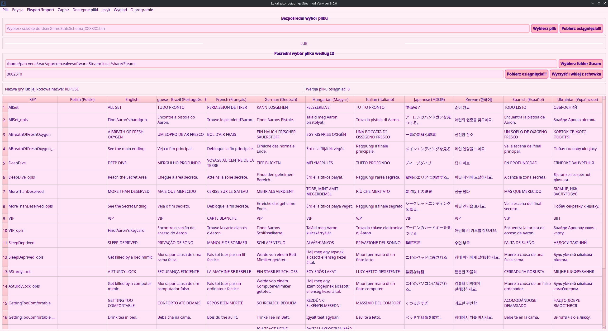

[](https://github.com/PanVena/SteamAchievementLocalizer/blob/main/readmes/README.uk.md)
[](https://github.com/PanVena/SteamAchievementLocalizer/blob/main/README.md)


<h1 align="center">🏆 Lokalizator osiągnięć Steam od Veny</h1>
<p align="center">
Graficzne narzędzie (PyQt6) do przeglądania, edycji i lokalizacji plików osiągnięć Steam <code>UserGameStatsSchema_*.bin</code>.
</p>
<p align="center">
<b>⬇️ Pobierz najnowszą wersję</b>
</p>

<p align="center">
  <a href="https://github.com/PanVena/SteamAchievementLocalizer/releases/latest/download/SteamAchievementLocalizer-win64.zip"></a>
  <a href="https://github.com/PanVena/SteamAchievementLocalizer/releases/latest/download/SteamAchievementLocalizer-linux64.AppImage"></a>
  <a href="https://github.com/PanVena/SteamAchievementLocalizer/releases/"></a>
</p>

<p align="center">
  
</p>

---

## Spis treści
- [✨ Funkcje](#-funkcje)
- [⚠️ Ostrzeżenie o edycji](#️-ostrzeżenie-o-edycji)
- [🚀 Szybki start](#-szybki-start)
- [📂 Lokalizacja plików](#-lokalizacja-plików)
- [📝 Eksport / Import](#-eksport--import)
- [🧠 Algorytm przetwarzania](#-algorytm-przetwarzania)
- [🛠 Architektura i szczegóły techniczne](#-architektura-i-szczegóły-techniczne)
- [❓ FAQ](#-faq)
- [🎨 Tworzenie motywów](#-tworzenie-motywów)
- [🌍 Lokalizacja](#-lokalizacja)
- [🤝 Kontrybucja](#-kontrybucja)
- [🔐 Licencja](#-licencja)
- [👤 Autor i społeczność](#-autor-i-społeczność)
- [💬 Kontakt](#-kontakt)

---

## ✨ Funkcje
- **🚀 Automatyczne wykrywanie ścieżki Steam** (Rejestr Windows / Linux / warianty Snap; macOS częściowo obsługiwany).
- **📂 Dwa sposoby ładowania:**
  - ręcznie (wybór `.bin`);
  - przez ID gry (można wkleić pełny URL `https://store.steampowered.com/app/123456/`).
- **🏆 Parsowanie osiągnięć i budowa tabeli:**
  - automatyczne tworzenie osobnego wiersza dla opisów (`*_opis`) jeśli w bloku są duplikaty;
  - automatyczne dodanie kolumny `ukrainian`, jeśli brakuje;
  - gwarancja obecności `english` (puste jeśli nie ma w pliku).
- **✏️ Edycja tabeli** bez opuszczania aplikacji.
- **🔍 Globalne wyszukiwanie** z podświetleniem + filtrowanie wierszy.
- **🔄 Wyszukaj / Zamień** dla wybranej kolumny (dialog).
- **👁️ Włączanie / wyłączanie widoczności kolumn**.
- **📤 Eksport CSV:**
  - pełny (wszystkie języki z pliku);
  - format tłumaczenia (english + tłumaczenie + kontekst).
- **📥 Import CSV** z powrotem do wybranej kolumny języka.
- **💾 Nadpisanie lokalizacji** wewnątrz pliku binarnego.
- **📁 Podgląd i otwieranie** oryginalnego pliku binarnego w menedżerze plików.
- **📋 Lista wszystkich `UserGameStatsSchema_*.bin`** w Steam z:
  - nazwa gry (`gamename`);
  - wersja (`version`);
  - przybliżona liczba osiągnięć (heurystyka poprzez liczbę wpisów angielskich).
- **⚙️ Cache ustawień** poprzez `QSettings`: język UI, ścieżki, ostatnie ID, ostatnia wersja (dla ostrzeżenia o aktualizacji).
- **🌍 Rozszerzalny wielojęzyczny UI** - obecnie English / Українська / Polski.
- **🎨 Dynamiczny system motywów** - motywy ładowane automatycznie z plików JSON.
- **🔌 Architektura wtyczek** z modułowymi komponentami.
  - format do tłumaczenia (english + translation + kontekst).
- Import CSV do wybranej kolumny językowej.
- Nadpisywanie lokalizacji w pliku binarnym.
- Podgląd i otwarcie oryginalnego pliku w menedżerze plików.
- Lista wszystkich `UserGameStatsSchema_*.bin` w Steam z:
  - nazwą gry (`gamename`);
  - wersją (`version`);
  - przybliżoną liczbą osiągnięć (heurystyka po liczbie wpisów angielskich).
- Cache ustawień w `QSettings`: język UI, ścieżki, ostatnie ID, ostatnia wersja (ostrzeżenie przy aktualizacji).
- Wielojęzyczny interfejs (English / Українська / Polski).

---

## ⚠️ Ostrzeżenie o edycji
Edycja `.bin` może spowodować:
- konflikty cache w Steam;
- wyświetlanie niepoprawnych tekstów;
- konieczność ponownego wygenerowania pliku.

Jeśli gra nie widzi tłumaczenia:
1. Zamknij Steam.
2. Usuń docelowy `UserGameStatsSchema_XXXX.bin`.
3. Otwórz stronę gry (pliki się odtworzą).
4. Zastosuj tłumaczenie ponownie.

Zalecenie: wykonaj kopię oryginalnego `.bin` przed zmianami.

---

## 🚀 Szybki start
1. Pobierz [najnowsze wydanie](https://github.com/PanVena/SteamAchievementLocalizer/releases/latest).
2. Uruchom plik wykonywalny.
3. Podaj ID gry albo wybierz `.bin` ręcznie.
4. Przetłumacz / edytuj.
5. (Opcjonalnie) Eksport CSV → do zespołu → import z powrotem.
6. Zapisz:  
   - do Steam (aby od razu zobaczyć efekt);  
   - lub w inne miejsce (backup / dystrybucja).

---

## 📂 Lokalizacja plików
Typowa ścieżka (Windows):
```
C:\Program Files (x86)\Steam\appcache\stats\UserGameStatsSchema_XXXX.bin
```
Linux (jeden z wariantów):
```
~/.local/share/Steam/appcache/stats/UserGameStatsSchema_XXXX.bin
```
Warianty Snap wyszukiwane automatycznie.  
macOS na razie bez gwarantowanej auto-detekcji (wybierz ręcznie).

---

## 📝 Eksport / Import

### Pełny eksport
CSV zawiera wszystkie kolumny (również potencjalne serwisowe). Przydatne do analizy lub archiwizacji.

### Eksport do tłumaczenia
Struktura:
```
key,english,translation,<kontekst>
```
- `translation` — kolumna edytowana przez tłumacza.
- `<kontekst>` — dodatkowa (wybierana w dialogu), np. `polish`, `german` lub opisowa.

### Import
1. Wybierz docelową kolumnę (gdzie zapisać) w oknie dialogowym.
2. Załaduj CSV z polami `key`, `translation`.
3. Puste komórki `translation` są ignorowane.

### UWAGA: Zamierzone nadpisanie kolumny english
Jeżeli chcesz nadpisać bazowe ciągi angielskie nową wersją (np. ujednoliconą lub zmodyfikowaną):
- Eksportuj w formacie tłumaczeniowym.
- W kolumnie `translation` wpisz nowe teksty, które mają stać się „english”.
- Przy imporcie wybierz jako cel `english`.
- Aplikacja wyczyści stare wpisy angielskie w blokach i wstawi nowe.
Pamiętaj, że inne lokalizacje mogą polegać na pierwotnym znaczeniu angielskiego – zrób pełny eksport dla kopii bezpieczeństwa.

---

## 🧠 Algorytm przetwarzania
1. Odczyt bajtów pliku.
2. Podział na bloki markerami `\x00bits\x00 | \x02bit\x00`.
3. Wyszukanie klucza osiągnięcia: wzorzec w bloku `\x00\x01name\x00(.*?)\x00`.
4. Odrzucenie bloku bez `\x01english\x00`.
5. Ekstrakcja etykiet językowych wzorcem `\x01<lang>\x00<text>\x00`.
6. Filtrowanie słów serwisowych (`EXCLUDE_WORDS`).
7. Tworzenie dwóch możliwych wierszy:
   - główny (`key`);
   - opis (`key_opis`) jeśli duplikaty językowe.
8. Wymuszenie kolumn `ukrainian` i `english`.
9. Budowa tabeli + kolejność nagłówków: `key`, `ukrainian`, `english`, reszta (alfabetycznie).
10. Przy zapisie:
    - czyszczenie poprzednich segmentów języka (dla wybranego języka);
    - wstawienie nowych za markerami `english` lub ich zastąpienie (dla english);
    - wynik: nowy blok binarny.

---

## 🛠 Architektura i szczegóły techniczne
| Komponent | Opis |
|-----------|------|
| GUI | PyQt6 (`QMainWindow`, `QTableWidget`) |
| Przechowywanie stanu | `QSettings` (język, ścieżki, wersja, ostatnie ID) |
| **Lokalizacja** | **Auto-ładowanie JSON z `assets/locales/` z obsługą metadanych** |
| **Motywy** | **Auto-ładowanie JSON z `assets/themes/` z sortowaniem według priorytetu** |
| **System wtyczek** | **Komponenty modułowe: `theme_manager`, `ui_builder`, `file_manager`, itp.** |
| Podświetlenie wyszukiwania | Własny `HighlightDelegate` |
| Dialogi | `FindReplaceDialog`, `ContextLangDialog`, `UserGameStatsListDialog` |
| Framework UI | Własny system lokalizacji JSON (nie Qt Linguist) |
| Algorytm wstawiania | Skanowanie pozycyjne + składanie bajtów `bytearray` |
| Budowa wierszy | Heurystyka unikania duplikatów (opis w `_opis`) |

---

## ❓ FAQ

| Pytanie | Odpowiedź |
|---------|-----------|
| Nie widzę tłumaczenia w Steam | Zamknij Steam → usuń plik → otwórz stronę gry |
| Pusta lista | Zły plik albo brak markerów `english` |
| Zniekształcone znaki | Upewnij się co do UTF-8 i poprawnego CSV |
| Brak cofania po imporcie | Import przebudowuje tabelę całkowicie – to normalne |
| Ile języków jest wspieranych? | Tyle, ile realnie jest w `.bin` + wymuszone `ukrainian` |
| Mogę dodać język interfejsu? | Tak, dodaj JSON do `assets/locales/` |

---

## 🤝 Kontrybucja
1. Fork → nowa gałąź → zmiany → Pull Request.
2. Jasno opisz co zmienia PR (UI / logika / lokalizacja).
3. **Dla motywów** — po prostu dodaj pliki JSON do `assets/themes/` (zobacz [przewodnik motywów](contribution/THEMES.md)).
4. **Dla języków** — po prostu dodaj pliki JSON do `assets/locales/` (zobacz [przewodnik lokalizacji](contribution/LOCALES.md)).
5. Sprawdź:
   - ładowanie pliku;
   - eksport / import;
   - zapis do Steam i do osobnego pliku;
   - brak crashy przy zmianie języka UI.

Pomysł bez kodu? — Utwórz Issue.

---

## 🎨 Tworzenie motywów

Chcesz stworzyć własne motywy dla aplikacji? **Edycja kodu nie jest potrzebna!**

Po prostu utwórz plik JSON w `assets/themes/` a twój motyw automatycznie pojawi się w menu.

**📖 Dokumentacja:**
- **[Przewodnik tworzenia motywów (English)](contribution/THEMES.md)** - Pełne instrukcje w języku angielskim
- **[Посібник зі створення тем (Українська)](contribution/THEMES_UA.md)** - Pełna instrukcja po ukraińsku

**✨ Funkcje:**
- 🎨 **Auto-wykrywanie**: Dodaj plik JSON motywu → pojawia się w menu automatycznie
- 🌍 **Wsparcie wielu języków**: Nazwy motywów w kilku językach
- 📊 **Inteligentne sortowanie**: Kontroluj pozycję motywu za pomocą wartości priorytetu
- 🎯 **Bez programowania**: Czysta konfiguracja JSON, zmiany w kodzie nie są potrzebne

**Przykład struktury motywu:**
```json
{
  "name": "MójMotyw",
  "display_names": {
    "en": "🌙 Dark Blue",
    "pl": "🌙 Ciemnoniebieska"
  },
  "priority": 50,
  "palette": { /* kolory */ },
  "styles": { /* CSS */ }
}
```

---

## 🌍 Lokalizacja

Chcesz dodać swój język do aplikacji? **Edycja kodu nie jest potrzebna!**

Po prostu utwórz plik JSON w `assets/locales/` a twój język automatycznie pojawi się w menu.

**📖 Dokumentacja:**
- **[Przewodnik dodawania języków (English)](contribution/LOCALES.md)** - Pełne instrukcje w języku angielskim
- **[Посібник з додавання мов (Українська)](contribution/LOCALES_UA.md)** - Pełna instrukcja po ukraińsku

**✨ Funkcje:**
- 🌐 **Auto-wykrywanie**: Dodaj plik JSON lokalizacji → pojawia się w menu języków automatycznie
- 📊 **Inteligentne sortowanie**: Kontroluj pozycję języka za pomocą wartości priorytetu
- 🔄 **System zapasowy**: Brakujące tłumaczenia są zastępowane angielskimi
- 🎯 **Bez programowania**: Czysta konfiguracja JSON, zmiany w kodzie nie są potrzebne

**Przykład struktury lokalizacji:**
```json
{
  "_locale_info": {
    "name": "Español",
    "native_name": "Español (Spanish)",
    "code": "es",
    "priority": 40
  },
  "app_title": "Localizador de Logros...",
  "language": "Idioma"
  // ... inne tłumaczenia
}
```

**Obecne języki:**
- 🇬🇧 **English** (priorytet: 10)
- 🇺🇦 **Українська** (priorytet: 20)
- 🇵🇱 **Polski** (priorytet: 30)

---

## 🔐 Licencja
MIT — wolno używać, modyfikować, tłumaczyć. Wdzięczność za ⭐ i wzmiankę o autorze.

---

## 👤 Autor i społeczność
Autor: **Vena**  
- [GitHub](https://github.com/PanVena)  
- Telegram: [@Pan_Vena](https://t.me/Pan_Vena)

Społeczność tłumaczy / dyskusji:
- Kanał: [Ліниві ШІ](https://t.me/linyvi_sh_ji)

---

## 💬 Kontakt
Pytania / błędy / pomysły → Issue lub Telegram.  
Podoba Ci się projekt? — Udostępnij i zostaw ⭐.

<p align="center">Z miłości do lokalizacji i gier 💛💙</p>