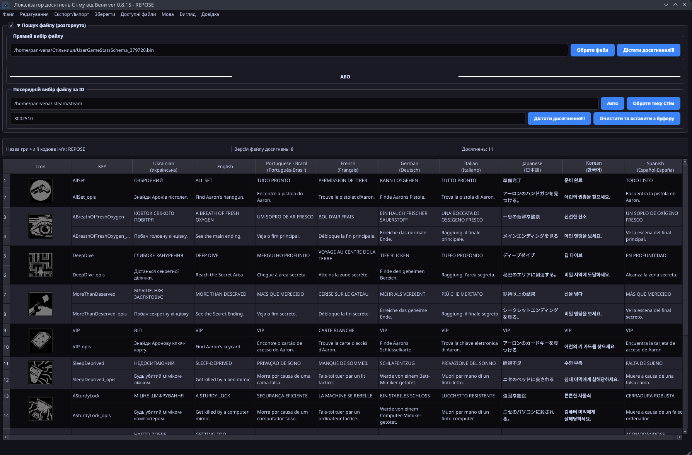

[](https://github.com/PanVena/SteamAchievementLocalizer/blob/main/README.md)
[](https://github.com/PanVena/SteamAchievementLocalizer/blob/main/readmes/README.pl.md)

<h1 align="center">🏆 Локалізатор досягнень Стіму від Вени</h1>
<p align="center">
Графічний інструмент (PyQt6) для перегляду, редагування та локалізації файлів Steam досягнень <code>UserGameStatsSchema_*.bin</code>.
</p>
<p align="center">
  <a href="https://github.com/PanVena/SteamAchievementLocalizer/releases/latest"><b>⬇️ Завантажити останню версію</b></a>
</p>

<p align="center">
  
</p>

---

## Зміст
- [✨ Можливості](#-можливості)
- [⚠️ Попередження про редагування](#️-попередження-про-редагування)
- [🚀 Швидкий старт](#-швидкий-старт)
- [📂 Де лежать файли](#-де-лежать-файли)
- [📝 Експорт / Імпорт](#-експорт--імпорт)
- [🧠 Алгоритм обробки](#-алгоритм-обробки)
- [🛠 Архітектура та технічні деталі](#-архітектура-та-технічні-деталі)
- [❓ FAQ](#-faq)
- [🤝 Контрибуція](#-контрибуція)
- [🔐 Ліцензія](#-ліцензія)
- [👤 Автор і спільнота](#-автор-і-спільнота)
- [💰 Підтримати](#-підтримати)
- [💬 Звʼязок](#-звʼязок)

---

## ✨ Можливості
- Автовизначення шляху Steam (Windows Registry / Linux / Snap варіанти; macOS поки частково не покритий).
- Два способи завантаження:
  - вручну (вибір `.bin`);
  - за Game ID (можна вставити повний URL виду `https://store.steampowered.com/app/123456/`).
- Парсинг досягнень і побудова таблиці:
  - автоматичне створення окремого рядка для описів (`*_opis`) якщо в блоці дублікати;
  - автододавання колонки `ukrainian`, якщо її немає;
  - гарантія наявності `english` (порожній, якщо відсутній у файлі).
- Редагування таблиці, праця не вилазячи з додатку.
- Глобальний пошук із підсвічуванням + фільтрація рядків.
- Пошук / Заміна для вибраної колонки (через діалог).
- Увімкнення / вимкнення видимості колонок.
- Експорт CSV:
  - повний (усі мови у файлі);
  - формат для перекладу (english + translation + контекст).
- Імпорт CSV назад у вибрану мовну колонку.
- Перезапис локалізацій у бін-файл.
- Перегляд і відкриття оригінального файлу у файловому менеджері.
- Список усіх `UserGameStatsSchema_*.bin` у Steam із:
  - ім’ям гри (`gamename`);
  - версією (`version`);
  - приблизною кількістю досягнень (евристика за кількістю англомовних записів).
- Кешування налаштувань у `QSettings`: мова, шляхи, останній ID, остання версія для показу попередження при апдейті.
- Багатомовний UI (English / Українська / Polski).

---

## ⚠️ Попередження про редагування
Редагування `.bin` може призвести до:
- кешових конфліктів у Steam;
- відображення некоректних текстів;
- потреби перегенерації файлу.

Якщо гра не бачить переклад:
1. Закрити Steam.
2. Видалити цільовий `UserGameStatsSchema_XXXX.bin`.
3. Відкрити сторінку гри (файл знову згенерується).
4. Заново застосувати переклад.

Рекомендація: робіть копію оригінального `.bin` перед змінами.

---

## 🚀 Швидкий старт
1. Завантажити [останній реліз](https://github.com/PanVena/SteamAchievementLocalizer/releases/latest).
2. Запустити виконуваний файл.
3. Вказати Game ID або вибрати `.bin` вручну.
4. Перекласти / відредагувати.
5. (Опц.) Експортувати CSV → віддати команді → імпортувати.
6. Зберегти:  
   - у Steam (щоб одразу бачити ефект);  
   - або у власне місце (бекуп / поширення).

---

## 📂 Де лежать файли
Типовий шлях (Windows):
```
C:\Program Files (x86)\Steam\appcache\stats\UserGameStatsSchema_XXXX.bin
```
Linux (один із варіантів):
```
~/.local/share/Steam/appcache/stats/UserGameStatsSchema_XXXX.bin
```
Snap (варіанти шукаються автоматично).  
macOS поки не має гарантованої автоматичної детекції (можна вибрати вручну).

---

## 📝 Експорт / Імпорт

### Повний експорт
CSV містить усі колонки (включно з потенційними службовими). Зручно для аналізу чи архіву.

### Експорт для перекладу
Структура:
```
key,english,translation,<контекст>
```
- `translation` — колонка, яку редагує перекладач.
- `<контекст>` — додаткова (вибираєте в діалозі), напр. `polish`, `german` або описова.

### Імпорт
1. Вибрати цільову колонку (куди записувати) в діалозі.
2. Завантажити CSV з полями `key`, `translation`.
3. Порожні клітинки `translation` ігноруються.

---

## 🧠 Алгоритм обробки
1. Зчитування байтів файлу.
2. Поділ на блоки за маркерами `\x00bits\x00 | \x02bit\x00`.
3. Пошук ключа досягнення: всередині блоку шаблон `\x00\x01name\x00(.*?)\x00`.
4. Відкидання блоку, якщо відсутнє `\x01english\x00` (гарантія базової локалізовності).
5. Витяг мовних міток через патерн `\x01<lang>\x00<text>\x00`.
6. Фільтрація службових слів (набір `EXCLUDE_WORDS`).
7. Формування двох рядків:
   - основний (`key`);
   - опис (`key_opis`) якщо в блоці дублюються мовні ключі.
8. Гарантоване додавання колонок `ukrainian` та `english` (якщо їх не було).
9. Побудова таблиці й сортування заголовків: `key`, `ukrainian`, `english`, інші (алфавіт).
10. Зміни користувача при збереженні:
    - очищення попередніх мовних сегментів (для конкретної мови);
    - вставлення нових після маркерів `english` або заміна їх (для самої англійської);
    - результат — новий бінарний блок.

---

## 🛠 Архітектура та технічні деталі
| Компонент | Опис |
|-----------|------|
| GUI | PyQt6 (`QMainWindow`, `QTableWidget`) |
| Збереження стану | `QSettings` (мова, шляхи, версія, останній ID) |
| Мовні файли | JSON у `assets/locales/` |
| Виділення пошуку | Кастомний `HighlightDelegate` |
| Діалоги | `FindReplaceDialog`, `ContextLangDialog`, `UserGameStatsListDialog` |
| Локалізація інтерфейсу | Власна система через JSON (не Qt Linguist) |
| Алгоритм вставки | Позиційне сканування й побайтове складання `bytearray` |
| Побудова рядків | Евристика уникнення дублю в одному рядку (опис йде у `_opis`) |

---

## ❓ ЧаПи

| Питання | Відповідь |
|---------|-----------|
| Не бачу переклад у Steam | Закрий Steam → видали файл → відкрий сторінку гри |
| Порожній список | Файл не той або відсутні маркери `english` |
| Символи спотворені | Переконайтесь у UTF-8 та коректному CSV |
| Undo після імпорту відсутнє | Імпорт повністю перебудовує таблицю — це очікувано |
| Скільки мов підтримується? | Стільки, скільки реально є в `.bin` + примусово `ukrainian` |
| Можна додати ще мову інтерфейсу? | Так, додайте JSON у `assets/locales/` і оновіть `LANG_FILES` |

---

## 🤝 Контрибуція
1. Зробіть Fork → створіть гілку → внесіть зміни → Pull Request.
2. Опишіть чітко, що змінює PR (UI / логіка / локалізація).
3. Для мов — оновіть відповідний JSON у `assets/locales/` і відредагуйте `LANG_FILES` на початку `SteamAchievementLocalizer.py`.
4. Перевірте:
   - завантаження файлу;
   - експорт / імпорт;
   - збереження у Steam і в окремий файл;
   - відсутність крешів при зміні мови UI.

Щоб запропонувати ідею без коду — створіть Issue.

---

## 🔐 Ліцензія
MIT — вільно використовуйте, змінюйте, перекладайте. Буду вдячний за ⭐ і згадку автора.

---

## 👤 Автор і спільнота
Автор: **Вена**  
- [GitHub](https://github.com/PanVena)  
- Telegram: [@Pan_Vena](https://t.me/Pan_Vena)

Спільнота перекладачів / обговорень:
- Канал: [Ліниві ШІ](https://t.me/linyvi_sh_ji)

---

## 💰 Підтримати

- [Mono](https://send.monobank.ua/jar/9V3wRMZD7C)

---

## 💬 Звʼязок
Ідеї / питання / помилки → Issue або Telegram.  
Подобається проєкт? — Поширюй серед локалізаторів і постав ⭐.

<p align="center">З любовʼю до локалізації та ігор 💛💙</p>